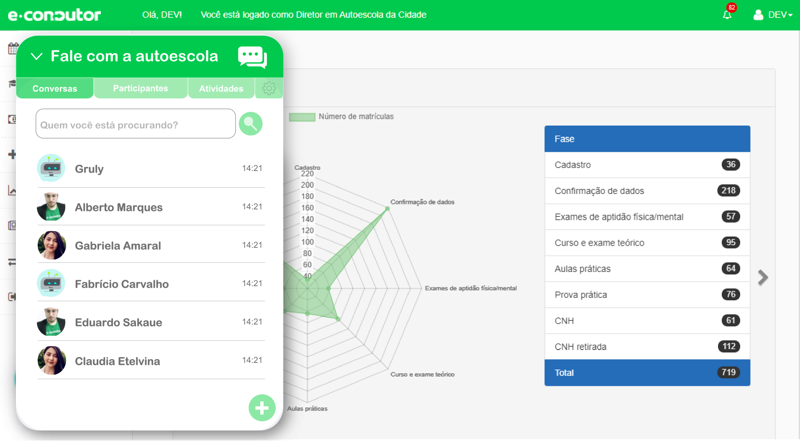

# ChatBot para help desk de 1º nível

Esse projeto é um desafio acadêmico proposto pela FATEC - Profº Jessen Vidal aos alunos do 6º semestre de 2020/2.

## Problema e Objetivo

Problema (Desafio fornecido pelo cliente): Desenvolver um sistema de comunicação interno e de envio de atividades
flutuante.

O objetivo é enviar demandas entre colaboradores e permitir que eles se comuniquem, individualmente ou em grupos
criados.

Será necessário criar dashboard dentro da janela flutuante para configurações.

Os usuários serão criados e vinculados automaticamente ao criar um novo perfil de utilização, seja aluno, diretor,
atendente ou instrutor.

## Requisitos Funcionais

- Interface flutuante
- Interface interna com botões (Alunos, Colaboradores, Chats, Atividades e Configurações)
- Criar campo de pesquisa dentro de alunos, colaboradores, chats e atividades
- Integração com o BD de usuários criados para alimentação dos contatos

## Requisitos Não Funcionais

- Linguagem Java (requisito Fatec)
- Banco de Dados Relacional (requisito Fatec)
- Documentações

## Organização das atividades

[Kanban do Github](https://github.com/ads-fatec-team3/chatbot/projects/1)

[Planejado vs Realizado (Tempo e Custo)](https://github.com/ads-fatec-team3/chatbot/blob/master/docs/Sprint%201/custos.md)

## Entregáveis Sprints

### Sprint 1
- Prototipação
- Mapeamento do Banco de Dados

### Sprint 2
- Backend com consultas
- MVP Frontend (Criação do componente de Chat)
- Mockup API cliente
- Refatoração Protótipo por permissões

### Sprint 3
- MVP Chatbot (Linguagem natural)

### Sprint 4
- Criação dos serviços para integração do front com o back (utilizando a api do back-end)
- Conexão de chat em tempo real (webSocket)

### Sprint 5
- Sistema de autenticação (utilização de jwt)
- Criação de atividades na agenda
- Controle de permissões (backend)
- Melhoria na estilização do frontend

### Sprint 6
- Controle de permissões (frontend)
- Melhorias nas validações
- Melhoria Chatbot
- Filtros para melhoria na experiência do usuário
- Entrega produto final
- Video de apresentação

## Etapas do Projeto (Sprints)

| Nº Sprint | Data Inicio | Data Final | Documento de entrega                                                                      |
|-----------|-------------|------------|-------------------------------------------------------------------------------------------|
| 1         | 07/09/2020  | 20/09/2020 | [acessar](https://github.com/ads-fatec-team3/chatbot/blob/master/docs/entregas/sprint1.md)|
| 2         | 21/09/2020  | 04/10/2020 | [acessar](https://github.com/ads-fatec-team3/chatbot/blob/master/docs/entregas/sprint2.md)|
| 3         | 05/10/2020  | 18/10/2020 | [acessar](https://github.com/ads-fatec-team3/chatbot/blob/master/docs/entregas/sprint3.md)|
| 4         | 19/10/2020  | 01/11/2020 | [acessar](https://github.com/ads-fatec-team3/chatbot/blob/master/docs/entregas/sprint4.md)|
| 5         | 02/11/2020  | 15/11/2020 | [acessar](https://github.com/ads-fatec-team3/chatbot/blob/master/docs/entregas/sprint5.md)|
| 6         | 16/11/2020  | 29/11/2020 | [acessar](https://github.com/ads-fatec-team3/chatbot/blob/master/docs/entregas/sprint6.md)|

## Protótipo

Print screen da prototipação feita no Adobe XD.

Pode acessar aqui: https://xd.adobe.com/view/76ccd03a-4998-4da1-9f5c-ca6f4ecf4023-239f/?fullscreen

## Integrantes

| Nome                           | Github                                           | LinkedIn                                                    |
|--------------------------------|--------------------------------------------------|-------------------------------------------------------------|
| Leandro Lopes (Scrum Master)   | [acessar](https://github.com/LLBueno)            | [acessar](https://www.linkedin.com/in/leandro-lopes-bueno/) |
| Marcio Ordonez (Product Owner) | [acessar](https://github.com/MarcioOrdonez)      | [acessar](https://www.linkedin.com/in/marcio-ordonez/)      |
| Bruna Totti                    | [acessar](https://github.com/brunatotti)         | [acessar](https://www.linkedin.com/in/brunatotti/)          |
| Eduardo Nunes                  | [acessar](https://github.com/eduns)              | [acessar](https://www.linkedin.com/in/eduns)                                                 |
| Greice Castilho                | [acessar](https://github.com/GreiceCastilho)     | [acessar]()                                                 |
| João Uchoas                    | [acessar](https://github.com/joaouchoas)         | [acessar](https://www.linkedin.com/in/joaouchoas)           |
| Letícia Barreto                | [acessar](https://github.com/lebarreto)          | [acessar](https://www.linkedin.com/in/leticiambarreto/)     |
| Raphael Ribeira                | [acessar](https://github.com/raphariibeira)      | [acessar](https://www.linkedin.com/in/raphael-victor-ribeira-de-paula-3a899a139/)|
| Robson Martins                 | [acessar](https://github.com/rmsilva007)         | [acessar](https://www.linkedin.com/in/robsonmartinssilva/)  |
