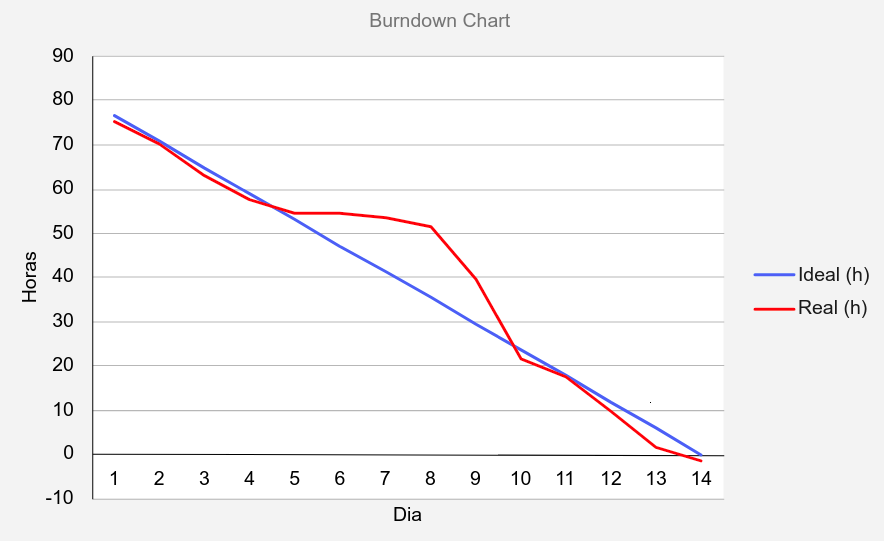
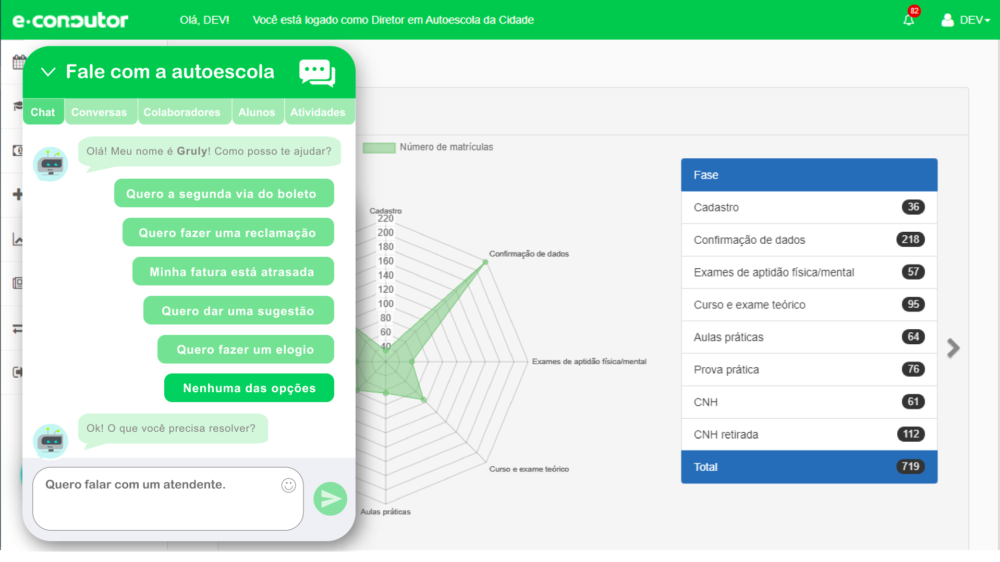
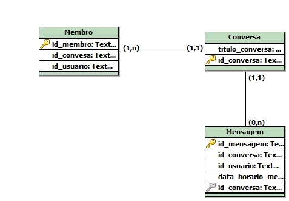

# Entrega Sprint 1

Essa sprint pode ser qualificada como uma sprint de visualização e preparação, pois houveram grandes esforços
em alinhar as necessidades do cliente com o entendimento da equipe e também ocorreu a inicialização do
ambiente de desenvolvimento Backend e Frontend.

## Gráfico Burndown

## Principais atividades

**Protipação das telas:** Feito com o auxílio do Adobe XD, é o grande entregável de valor para o cliente.
Com ela o cliente pode confiar que o resultado final estará dentro das espectativas e proporcionará aos
desenvolvedores uma boa base para o desenvolvimento, principalmente do Frontend. Vale destacar também que
é um protótipo navegável, oferecendo uma experiência muito superior do que com imagens estáticas como é
comum encontrar em outros protótipos.

O resultado pode ser acessado nesse link: https://xd.adobe.com/view/503a484d-6928-4e69-a0ec-ae30c1574dcb-0569/?fullscreen

**Modelagem do banco de dados:** Com o objetivo de criar uma melhor estrutura para os dados do sistema e descartar
inconsistências, foi feita uma modelagem para facilitar o mapeamento objeto relacional no Backend.

**Backend:** Foi criado e estrutura backend do projeto que utilizará Spring Boot em sua construção.
Aproveitando o modelo de dados feito, também foi realizado o mapeamento objeto relacional das entidades
dentro do backend.

**Frontend:** Foi criada a estrutura que utilizará Vue.js e feito um estudo de como acoplar componentes dentro de
outras aplicações.

**Documentação:** Foi criada toda uma documentação de definição de escopo inicial do projeto e de alguns estudos
realizados como, por exemplo, formas de integrar inteligência artificial no projeto, tudo isso pode ser
encontrado no [diretório de docs](https://github.com/ads-fatec-team3/chatbot/tree/master/docs).
