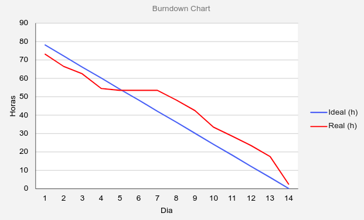
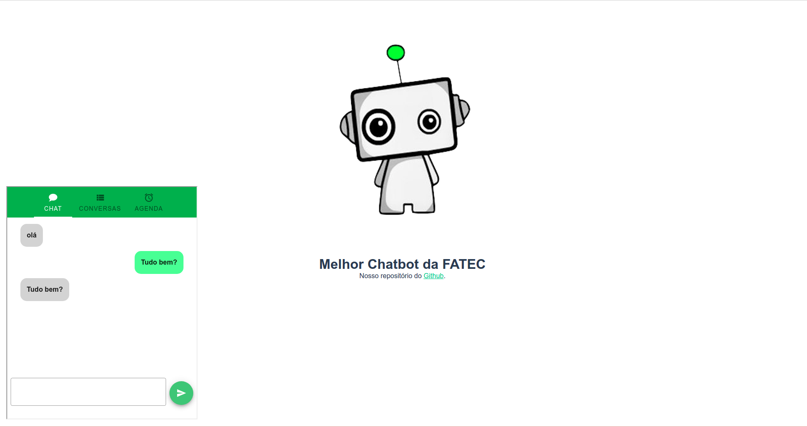

# Entrega Sprint 2

Essa sprint pode ser qualificada como uma sprint de visualização e preparação, pois houveram grandes esforços
em alinhar as necessidades do cliente com o entendimento da equipe e também ocorreu a inicialização do
ambiente de desenvolvimento Backend e Frontend.

## Gráfico Burndown

## Principais atividades

**MVP fronted:** Criação da versão inicial do componente do chatbot para interface flutuante do projeto.

**API Backend:** Interação do backend com o banco de dados através de consultas.

**Mockup API cliente:** Criação do mockup que representará os dados da aplicação do cliente.

Exemplo: https://ads-fatec-team3.free.beeceptor.com/schedule

**Documentação:** Foi criada toda uma documentação de definição de escopo inicial do projeto e de alguns estudos
realizados como, por exemplo, formas de integrar inteligência artificial no projeto, tudo isso pode ser
encontrado no [diretório de docs](https://github.com/ads-fatec-team3/chatbot/tree/master/docs).
