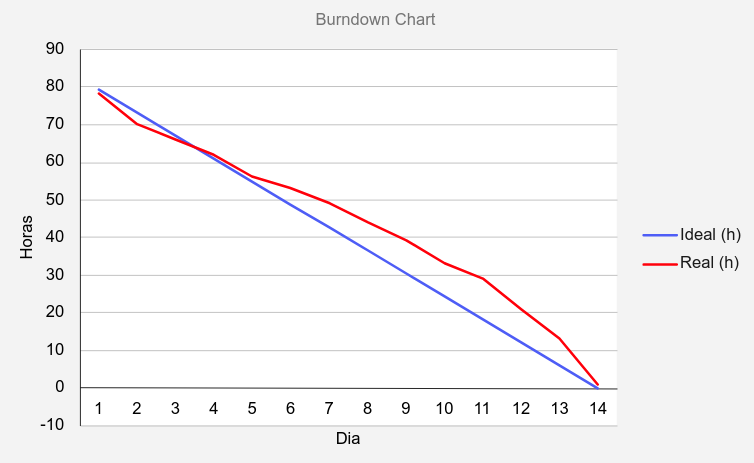
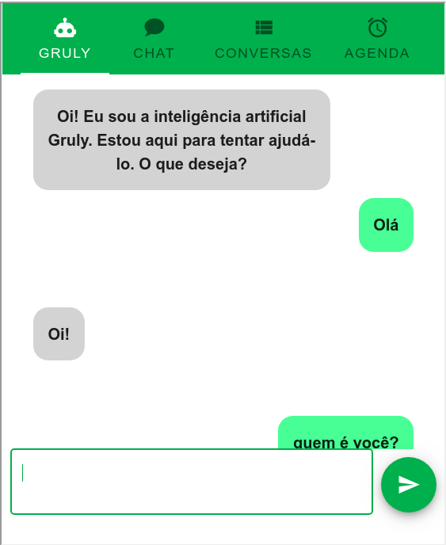

# Entrega Sprint 3

Essa sprint teve foco em dar funcionalidade para o frontend, para isso começamos a integração
do frontend com o backend e com o MVP do Bot Gruly.

## Gráfico Burndown

## Principais atividades

**MVP chatbot:** Criação da versão inicial do chatbot.

**Back x Front:** Integração do frontend com rotas do backend.

**Documentação:** Foi criada toda uma documentação de definição de escopo inicial do projeto e de alguns estudos
realizados como, por exemplo, formas de integrar inteligência artificial no projeto, tudo isso pode ser
encontrado no [diretório de docs](https://github.com/ads-fatec-team3/chatbot/tree/master/docs).
