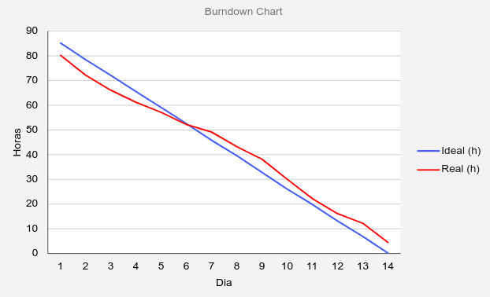
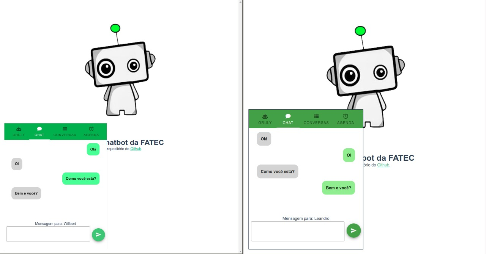

# Entrega Sprint 4

Essa sprint teve foco em deixar o chat funcional em tempo real através de um
WebSocket.

## Gráfico Burndown

## Principais atividades

**WebSocket Servidor:** Inclusão do server do Web Socket no Backend.

**WebSocket Cliente:** Inclusão do cliente do Web Socket no Frontend.

**Documentação:** Foi atualizada toda a documentação do acompanhamento do projeto, tudo isso pode ser
encontrado no [diretório de docs](https://github.com/ads-fatec-team3/chatbot/tree/master/docs).
