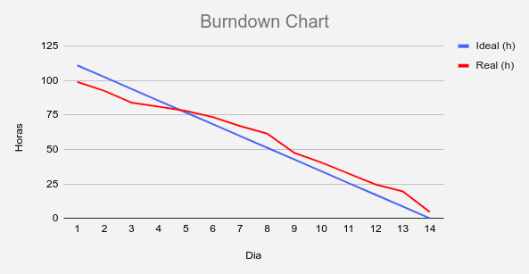
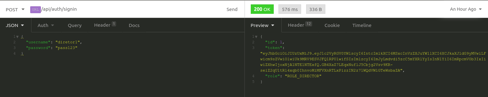
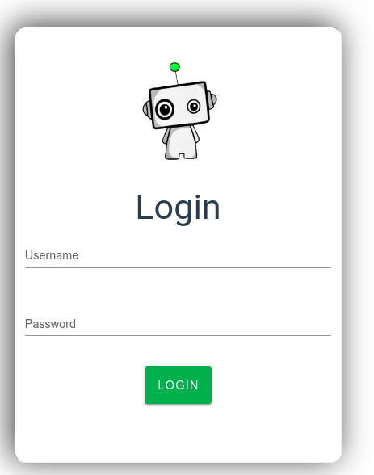
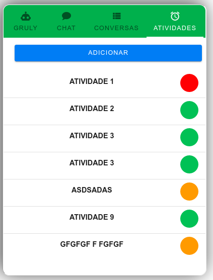
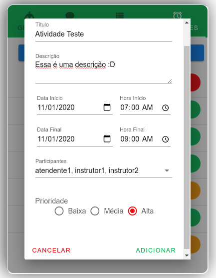
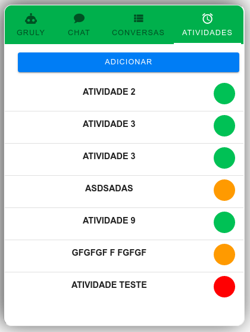

# Entrega Sprint 5

## Gráfico Burndown

### Foco da Sprint

- Sistema de autenticação (utilização de jwt)
- Criação de atividades na agenda
- Controle de permissões (backend)
- Melhoria na estilização do frontend

## Detalhes Atividades

### Sistema de autenticação e permissões

Adição de autenticação por Token JWT para proteção das rotas do sistema.

Após autenticado via JWT uma das informações de resposta é a ROLE do usuário,
com ela serão controladas as permissões de visualização no front posteriormente.

Com o JWT implementado no backend foi incluído sistema de login no front, para ter acesso ao sistema.

### Criação de Atividades

Também foi implementada a criação de atividades no sistema, parte importante dele.

### Funcionalidades Novas

**Documentação:** Foi atualizada toda a documentação do acompanhamento do projeto, tudo isso pode ser
encontrado no [diretório de docs](https://github.com/ads-fatec-team3/chatbot/tree/master/docs).
