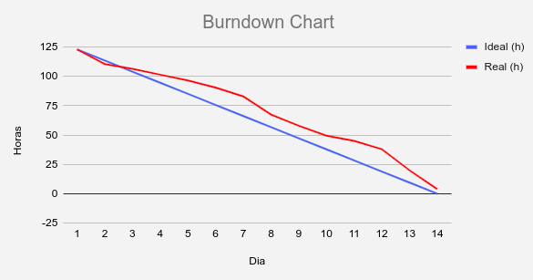
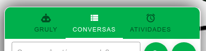
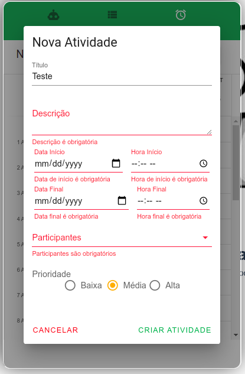
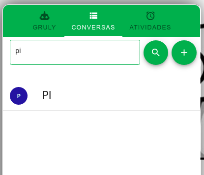

# Entrega Sprint 6

## Gráfico Burndown

### Foco da Sprint

- Controle de permissões (frontend)
- Melhorias nas validações
- Filtros para melhoria na experiência do usuário

## Detalhes Atividades

### Controle de Permissões (front)

Mostra somente o conteúdo do tipo do usuário, então, por exemplo, o Diretor e Atendente não conseguem
ver o chatbot.

### Melhorias nas validações

Adicionada validação nos formulários para melhorar a experiência do usuário em saber
os campos obrigatórios e não conseguir submeter sem eles.

### Adição de filtro de pesquisa

Adicionado filtro para facilitar na busca em listagem.

## Resumo Final do Projeto

**Documentação:** Foi atualizada toda a documentação do acompanhamento do projeto, tudo isso pode ser
encontrado no [diretório de docs](https://github.com/ads-fatec-team3/chatbot/tree/master/docs).
